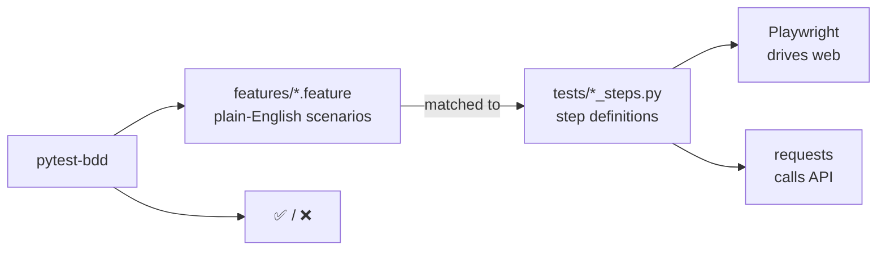
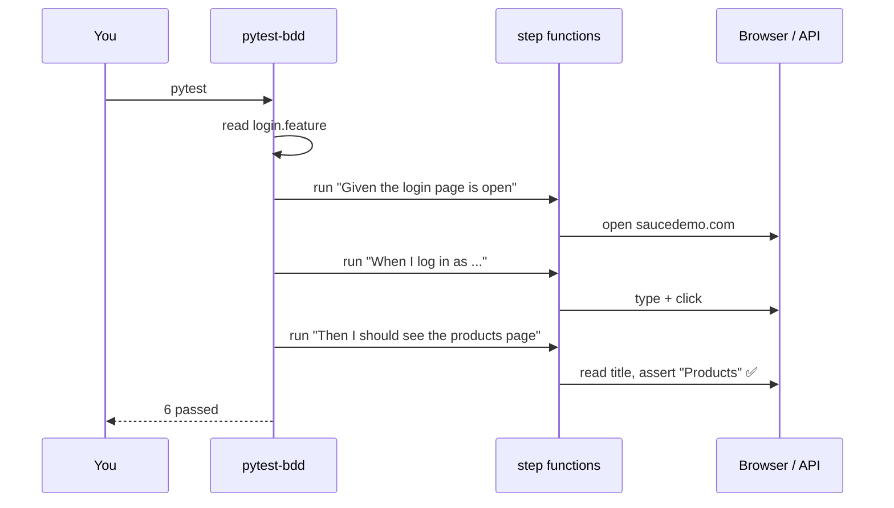

# LEARN.md — From Zero to Writing BDD Tests in this Repo

> Assumes you have **never coded before**. Read top to bottom.
> Project: **BDD (Behaviour-Driven Development)** — we write tests as plain-English
> sentences first, then connect each sentence to code. Covers both **web** and **API**.

---

## 0. The big idea: tests anyone can read

Normal tests are code. **BDD** tests are written in near-English using a format called **Gherkin**, so even a non-programmer (a manager, a client) can read what's being tested:

```gherkin
Scenario: Successful login lands on the products page
  Given the login page is open
  When I log in as "standard_user" with password "secret_sauce"
  Then I should see the products page
```

Each line (`Given`/`When`/`Then`) is later wired to a small Python function called a **step definition**. The English lives in `.feature` files; the code lives in `tests/`.

- **Given** = the starting situation (setup)
- **When** = the action you take
- **Then** = the expected result (the check)



This repo shows BDD over **two layers at once**: a web login (via Playwright) and a users API (via requests).

---

## 1. Set up your computer

Install **Python** ([python.org/downloads](https://www.python.org/downloads/); Windows: tick "Add to PATH") and **Git** ([git-scm.com](https://git-scm.com/downloads)). Then:
```bash
git clone https://github.com/selvamjstester/bdd-pytest-python.git
cd bdd-pytest-python
python3 -m venv .venv
source .venv/bin/activate            # Windows: .venv\Scripts\activate
pip install -r requirements.txt
python -m playwright install chromium   # the browser for the web scenarios
```

---

## 2. Terminal basics
`pwd` (where am I), `ls` (list files), `cd folder` / `cd ..` (move around), `source .venv/bin/activate` (enter the library sandbox).

---

## 3. Tiny Python primer
```python
def open_login(page, state):     # a step definition is just a function
    page.goto("https://...")     # do an action
    state["page"] = page         # remember something for later steps

assert "Products" == title       # the check inside a Then step
```
- `#` = comment. Indentation groups lines. `state` is a shared bag to pass data between steps.

---

## 4. Tour of every file

```
bdd-pytest-python/
├── requirements.txt
├── pytest.ini                 # points pytest-bdd at the features/ folder
├── conftest.py                # provides the shared "state" bag
├── features/                  # THE ENGLISH
│   ├── login.feature          # web login scenarios
│   └── users_api.feature      # API scenarios
└── tests/                     # THE CODE behind each English line
    ├── test_login_steps.py    # steps for login.feature
    └── test_users_api_steps.py# steps for users_api.feature
```

### A feature file
```7:14:features/login.feature
  Scenario: Successful login lands on the products page
    When I log in as "standard_user" with password "secret_sauce"
    Then I should see the products page

  Scenario: Locked-out user is rejected
    When I log in as "locked_out_user" with password "secret_sauce"
    Then I should see an error containing "locked out"
```

### The step definitions behind it
```5:22:tests/test_login_steps.py
scenarios("../features/login.feature")

BASE_URL = os.getenv("BASE_URL", "https://www.saucedemo.com")


@given("the login page is open")
def open_login(page, state):
    page.goto(BASE_URL)
    state["page"] = page


@when(parsers.parse('I log in as "{username}" with password "{password}"'))
def do_login(state, username, password):
    page = state["page"]
    page.fill("#user-name", username)
```
- `scenarios("../features/login.feature")` tells pytest-bdd: "turn every scenario in this file into a runnable test."
- `@given("the login page is open")` connects that exact English line to this function.
- `parsers.parse('... "{username}" ...')` captures the words in quotes and passes them into the function as `username`/`password`. That's how the English "standard_user" reaches your code.

### API steps (`test_users_api_steps.py`)
Same idea, but the steps call the JSONPlaceholder API with `requests` instead of a browser — proving BDD isn't just for UIs.

---

## 5. How a scenario runs



---

## 6. Run the tests

```bash
pytest --browser chromium               # all scenarios (web needs a browser)
pytest tests/test_users_api_steps.py    # only the API scenarios (no browser)
pytest -v                               # show each scenario name
```

---

## 7. Write your own scenario (guided)

**Goal:** add an API scenario that fetches a single user.

1. Open `features/users_api.feature` and add:
```gherkin
  Scenario: Fetch a single user
    When I request user "3"
    Then the response status should be 200
    And the returned user id should be "3"
```
2. Good news: the step `When I request user "..."`, `the response status...`, and `the returned user id...` **already exist** in `tests/test_users_api_steps.py`. So you don't write any code — you just described a new case in English and it works.
3. Run it:
```bash
pytest tests/test_users_api_steps.py -v
```

**Next challenge:** add a *new* Then step in English like `And the user's name should not be empty`, then create its step function in `test_users_api_steps.py` using `@then(parsers.parse("the user's name should not be empty"))`.

> This is the superpower of BDD: new scenarios are often just new English using steps you already built.

---

## 8. How CI works
`.github/workflows/ci.yml` installs Python, the browser, and runs all scenarios on every push (see the **Actions** tab).

---

## 9. Troubleshooting

| Symptom | Fix |
|---------|-----|
| `StepDefinitionNotFoundError` | The English line has no matching `@given/@when/@then`. Match the text exactly. |
| Browser errors | Run `python -m playwright install chromium`. |
| `No module named pytest_bdd` | Activate venv, `pip install -r requirements.txt`. |

---

## 10. Learn more
- **pytest-bdd:** https://pytest-bdd.readthedocs.io/
- **Gherkin syntax:** https://cucumber.io/docs/gherkin/reference/
- **Playwright (Python):** https://playwright.dev/python/
```
